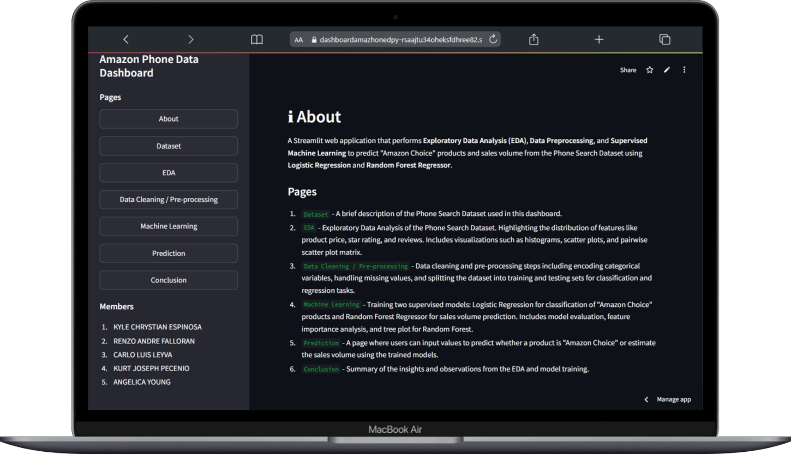
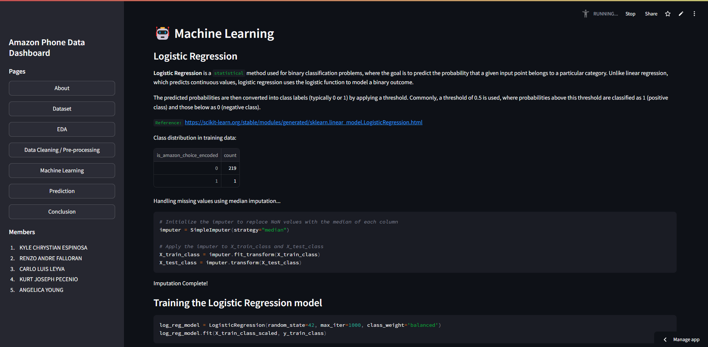
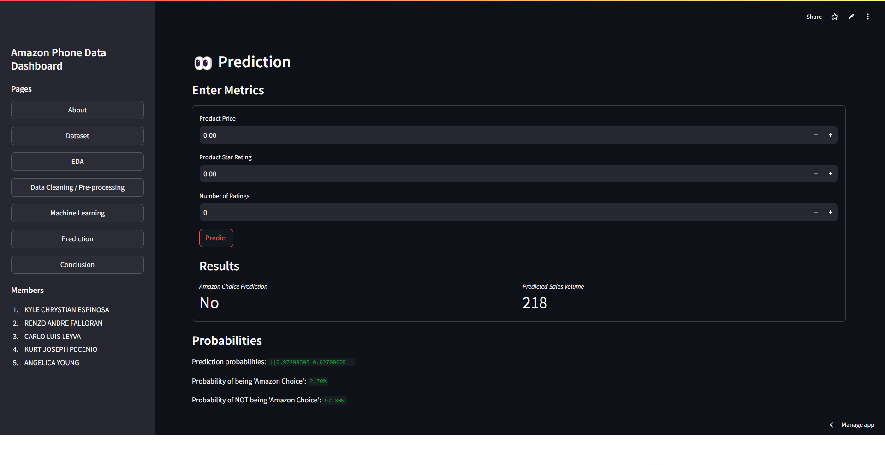

# Amazon Phone Data Dashboard

A Streamlit web application that performs **Exploratory Data Analysis (EDA)**, **Data Preprocessing**, and **Supervised Machine Learning** to predict "Amazon Choice" products and sales volume from the Phone Search Dataset using **Logistic Regression** and **Random Forest Regressor**.

### 🙍🏻‍♂️ Members:
1. Kyle Chrystian Espinosa
2. Renzo Andre Falloran
3. Carlo Luis Leyva
4. Kurt Joseph Pecenio
5. Angelica Young

### 🔗 Links:

- 🌐 [Streamlit Link]( https://dashboardamazhonedpy-rsaajtu34oheksfdhree82.streamlit.app/)
- 📗 [Google Colab Notebook](https://colab.research.google.com/drive/1h0pu9_x6SK-1tHLppzMmRK3v-lVIOKiZ?usp=sharing))

### 📊 Dataset:

- [Amazon Phone Data: Prices, Ratings & Sales Insight (Kaggle)](https://www.kaggle.com/datasets/shreyasur965/phone-search-dataset)

### 📖 Pages:

1. `Dataset` - A brief description of the Phone Search Dataset used in this dashboard.
2. `EDA` - Exploratory Data Analysis of the Phone Search Dataset. Highlighting the distribution of features like product price, star rating, and reviews. Includes visualizations such as histograms, scatter plots, pairwise scatter plot matrix.
4. `Data Cleaning / Pre-processing` - Data cleaning and pre-processing steps including encoding categorical variables, handling missing values, and splitting the dataset into training and testing sets for classification and regression tasks.
5. `Machine Learning` - Training two supervised models: Logistic Regression for classification of "Amazon Choice" products and Random Forest Regressor for sales volume prediction. Includes model evaluation, feature importance analysis, and tree plot for Random Forest.
6. `Prediction` - A page where users can input values to predict whether a product is "Amazon Choice" or estimate the sales volume using the trained models.
7. `Conclusion` - Summary of the insights and observations from the EDA and model training.

### 💡 Findings / Insights

Through exploratory data analysis and training of two classification models (`Logistic Regression` and `Random Forest Regressor`) on the Amazon Phone Data dataset, the key insights and observations are:

### 1. 📊 **Dataset Characteristics**:

- The dataset captures valuable e-commerce metrics such as product price, ratings, and sales volume.
- Some columns like `product_original_price`, `product_availability`, `unit_price`, and `coupon_text` had significant missing values, which were either removed or imputed as necessary.
- Feature normalization and encoding allowed us to prepare the dataset for effective modeling.

### 2. 📝 **Feature Distributions and Separability**:

- Visualizations, including histograms, scatter plots, and pairwise scatter plots, revealed relationships between product prices and star ratings.
- EDA highlighted that certain features, such as `product_price` and `product_star_rating`, have a strong correlation, suggesting potential for feature engineering in future work.

### 3. 📈 **Model Performance (Logistic Regression for Classification)**:

- The **Logistic Regression** model achieved high accuracy in predicting whether a product was designated as "Amazon Choice." This simple yet effective model was a good fit for the classification task.
- The confusion matrix and classification report further illustrated the model’s effectiveness in classifying the products accurately based on the provided features.

### 4. 📈 **Model Performance (Random Forest Regressor for Sales Volume Prediction)**:

- The **Random Forest Regressor** was trained to predict product sales volume, achieving a high R² score on both the training and testing data.
- Feature importance analysis identified `product_price` and `product_star_rating` as the most influential features for predicting sales volume, highlighting how customer preferences may affect sales.

#### **Summing up:**

This project successfully demonstrated effective data preparation, exploratory analysis, and modeling techniques on the Amazon Phone Data dataset. Both models achieved high accuracy in their respective tasks, providing insights into product sales prediction and classification.
